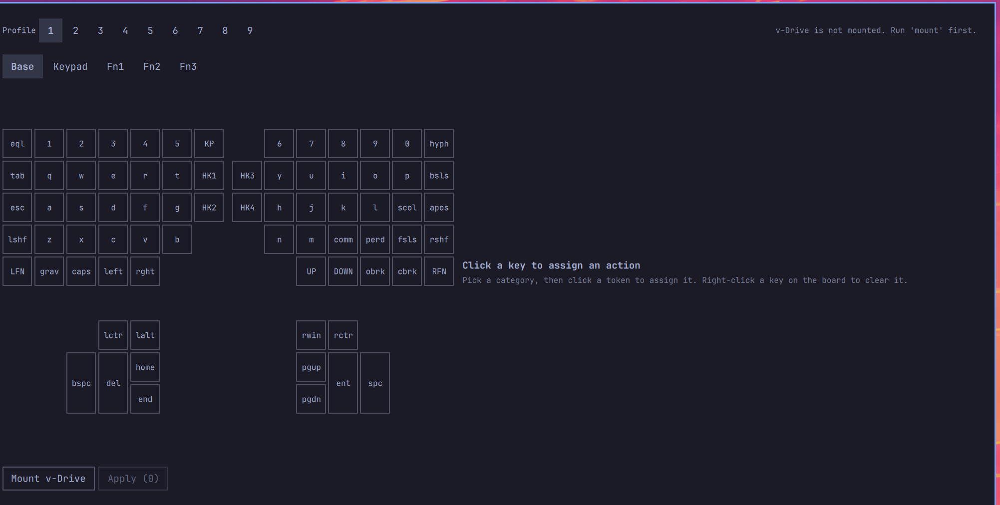

# Kinesis Advantage360 for Omarchy

Reprogram your Kinesis Advantage360 (SmartSet, non-Pro) from the Omarchy bar,
visually, instead of hand-editing the keyboard's own bracket/curly-brace
syntax on its v-Drive.




## Install

```bash
omarchy plugin add https://github.com/phenasdev/omarchy-kinesis-advantage360 --enable
```

Requires `udisks2` (already on stock Omarchy) — no other dependencies.

## How it works

The Advantage360 exposes a **v-Drive**: a plain USB mass-storage device that
appears once you trigger the "connect v-Drive" shortcut on the keyboard
itself. It holds `layouts/layout1.txt` … `layout9.txt` (one per profile),
each a plain-text file with sections for the `base`/`keypad`/`function1`/
`function2`/`function3` layers. This plugin mounts that drive (via
`udisks2`, no root), edits those files, and ejects it — nothing more.

- `bin/k360` — the whole backend: detect/mount/eject the v-Drive, and
  read/validate/write `layouts/layoutN.txt`. Every command prints one JSON
  object (`{"ok": true, ...}` or `{"ok": false, "error": "..."}`) and can be
  run standalone from a terminal for debugging.
- `data/position_tokens.json` / `data/action_tokens.json` — the keyboard's
  physical key map and the full action-token dictionary, transcribed from
  Kinesis's official "Direct Programming Guide" and "SmartSet Engine
  Supported Actions" documents.
- `Service.qml` — thin QML wrapper around `bin/k360` (polls v-Drive state,
  exposes mount/eject/read/write).
- `Panel.qml` / `Editor.qml` — the bar button and the visual keyboard popup.

## Scope (v1)

Only **simple remaps** (one action per key), across all 5 layers and all 9
profiles. Macros, tap-and-hold, RGB LED programming, and the foot pedal are
not editable here yet — if a key already has a macro, the editor shows
"macro" and leaves it alone unless you explicitly reassign that key to a
plain action (which replaces the macro).

`settings/` on the v-Drive (`settings.txt`, `app_settings.txt`) is never
touched.

## Safety

- Every write makes a timestamped backup of the profile's `.txt` file next
  to it before overwriting (`layoutN.txt.bak.<unix-time>`).
- Writes are atomic (written to a temp file, then renamed over the target).
- The editor validates every position/action token against the data files
  before writing anything to the drive.

## Using it

Click the bar icon to mount the v-Drive (trigger the keyboard's own
"connect v-Drive" shortcut first if it doesn't show up). Pick a profile and
layer, click a key to assign a new action (right-click resets it to
default), then **Apply**. When you're done, click **Eject v-Drive** before
switching the keyboard back to normal mode on the hardware.
